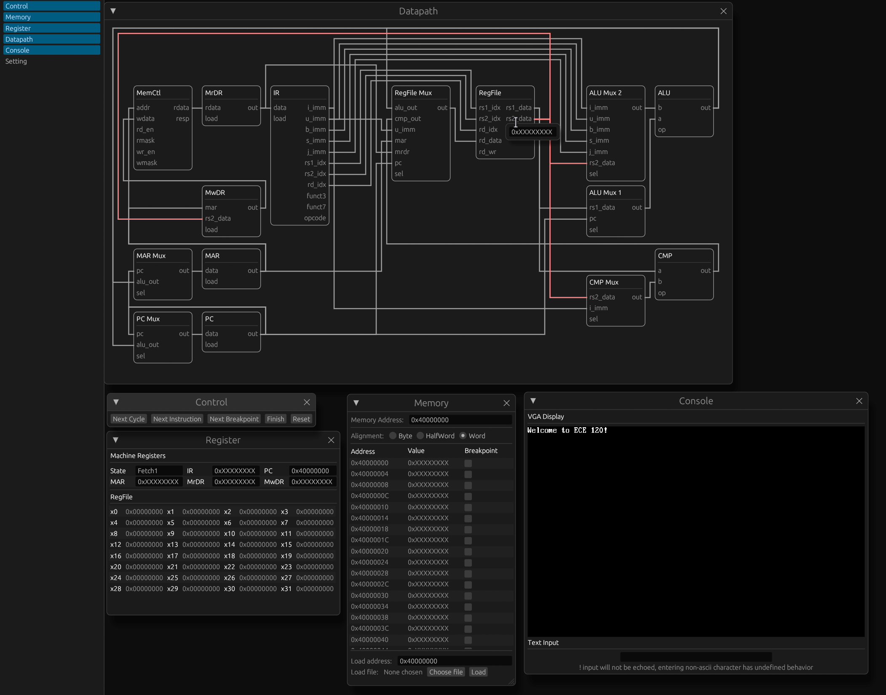

# rsim-rv32i: A cycle accurate multi-stage RV32i simulator
---


## Getting Started
Install the [rust toolchain](https://rustup.rs/)

Build the package
```
$ cargo run --release
```
Or if you prefer to install it
```
$ cargo install
```